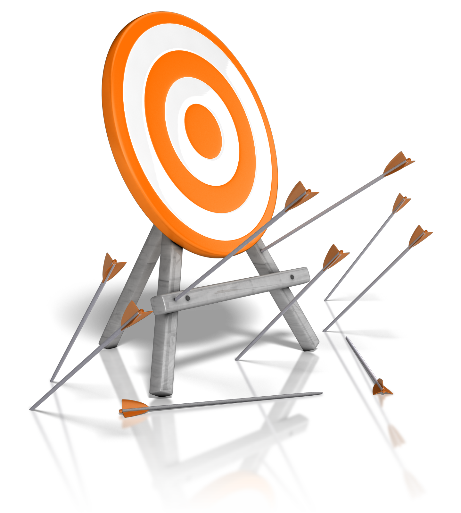

<p align="center">
  
  <h2 align="center">Front-end Challenge</h2>
</p>

A NOALVO é a maior plataforma brasileira de planejamento e compra de mídia out-of-home (ex: Relógio de rua, Outdoor..) e lidamos bastante com calculos de trigonometria e coisas relacionadas a latitude e longitude, então como você já deve imaginar, o nosso maior desafio no Front é justamente lidar com mapas e manter a UI leve e usável em qualquer dispositivo.

O teste é basicamente o seguinte, use a API do [Google Maps](https://developers.google.com/maps/documentation/javascript/tutorial) para plotar os dados do JSON que vem desse [endpoint](https://front-challenge.azurewebsites.net/api/markers-audiencias-json), que segue essa estrutura:

```js
{
  "markers": [
    { "coords": [ -23.5725807760417, -46.6461411696455 ] /* Lat e Lng respectivamente */ },
    { "coords": [-23.5689, -46.6474] /* Lat e Lng respectivamente */ }
  ],
  "audiencias": [
    { "percent": 47, "coords": [-23.57179739999999, -46.6440294] /* Lat e Lng respectivamente */ },
    { "percent": 87, "coords": [-23.5707478, -46.64682369999999] /* Lat e Lng respectivamente */ }
  ]
}
```

_só para entender, os `markers` são os pontos de mídia(como por exemplo um Outdoor) e as `audiências` são a quantidade de pessoas, de uma faixa etária/classe que passam em um lat/lng específico_

#### Desafio

Plote os markers e as audiências no mapa, as audiência são os [`Circles`](https://developers.google.com/maps/documentation/javascript/examples/circle-simple) da API do Google Maps, coloque o `radius` com valor de `100`, porém precisa ter `checkbox`s [dentro do mapa](#layout-exemplo) que determinam quais "camadas" estão ativas (se é para mostrar markers ou audiência ou os dois)

Faça a mesma coisa que o teste do Junior, porém agora use o atributo `percent` que vem nas audiências para determinar a cor do circulo. Esse atributo vai de 0 à 100 e segue a seguinte lógica:

+ Até 20, usar essa cor `#fff799`
+ Até 50, usar essa cor `#fcc80c`
+ Até 80, usar essa cor `#ff5400`
+ Acima de 80, usar `#da0909`

#### OBS

+ **Você não precisa terminar todo o desafio, nós avaliaremos seu código e a sua intenção em fazer as coisas, quando achar que esta pronto envie o projeto!**
+ No README do projeto precisa ter como rodar ele.

### Layout exemplo

Segue o arquivo [Adobe XD](https://github.com/IgorHalfeld/front-challenge/blob/master/assets/front-challenge.xd) e a screenshot


### Sobre a entrega do teste

Responda o email que nós já estavamos conversando com o link do seu repositório onde você colocou o código.

### Sobre o Framework

Aqui usamos [Vue.js](http://vuejs.org), mas fique a vontade para usar React(ou mesmo JavaScript Puro :D), só tenha em mente que aqui as coisas serão implementadas em Vue :D