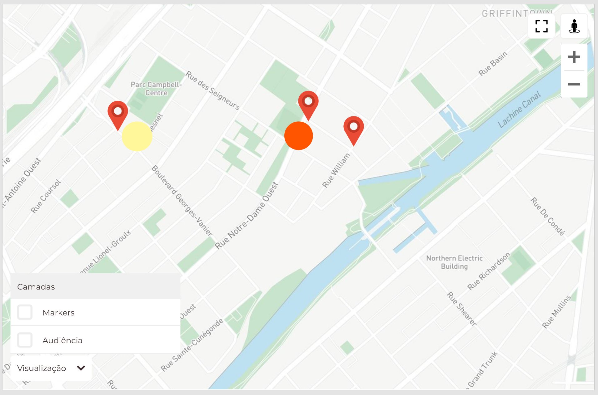

<p align="center">
  
  <h2 align="center">Front-end Challenge</h2>
</p>

A NOALVO é uma startup de tecnologia para [mídia out-of-home](https://pt.wikipedia.org/wiki/Publicidade_exterior) e lidamos bastante com calculos de trigonometria e coisas relacionadas a geoprocessamento. Como você já deve imaginar, o nosso maior desafio no Front é justamente lidar com mapas e manter a UI leve e usável em qualquer dispositivo.

## Como enviar

- Responda o email que nós já estavamos conversando com o link do seu repositório no GitHub onde você colocou o código. Prefira não usar o nome desse repositório para outros candidatos não copiarem seu código.
- **Você não precisa terminar todo o desafio, nós avaliaremos seu código e a sua intenção em fazer as coisas, quando achar que esta pronto envie o projeto!**
- Indique como rodar o projeto no arquivo README do repositório.

## Stack

Aqui usamos [Vue.js](http://vuejs.org), mas fique à vontade para usar React (ou até mesmo JavaScript Puro). Só tenha em mente que aqui as coisas serão implementadas em Vue 😎

## Sobre o desafio

Use a API do [Google Maps](https://developers.google.com/maps/documentation/javascript/tutorial) para plotar os dados do JSON que vem [desse endpoint](https://front-challenge.azurewebsites.net/api/markers-audiencias-json) e que segue a seguinte estrutura:

```js
{
  "markers": [
    { "coords": [ -23.5725807760417, -46.6461411696455 ] /* Lat e Lng respectivamente */ },
    { "coords": [-23.5689, -46.6474] /* Lat e Lng respectivamente */ }
  ],
  "audiencias": [
    { "percent": 47, "coords": [-23.57179739999999, -46.6440294] /* Lat e Lng respectivamente */ },
    { "percent": 87, "coords": [-23.5707478, -46.64682369999999] /* Lat e Lng respectivamente */ }
  ]
}
```

_Nesse schema, os `markers` são os pontos de mídia (como por exemplo um outdoor) e as `audiências` são a quantidade de pessoas de uma faixa etária/classe que passam em uma coordenada específica (latitude, longitude)_

Você deve plotar no mapa:
- os markers, como objetos [`Marker`](https://developers.google.com/maps/documentation/javascript/examples/marker-simple)
- as audiencias, como [`Circles`](https://developers.google.com/maps/documentation/javascript/examples/circle-simple), onde o `radius` deve ser `100` e a cor deve ser determinada de acordo com o atributo `percent` que vem no schema. Esse atributo vai de 0 à 100 e segue a seguinte lógica:
  + Até 20, usar essa cor `#fff799`
  + Até 50, usar essa cor `#fcc80c`
  + Até 80, usar essa cor `#ff5400`
  + Acima de 80, usar `#da0909`

Além disso, você deve implementar um controle de camadas vísiveis, que exibe/oculta os markers e os círculos no mapa, conforme o layout abaixo.


arquivo [Adobe XD](https://github.com/IgorHalfeld/front-challenge/blob/master/assets/front-challenge.xd) com o layout
